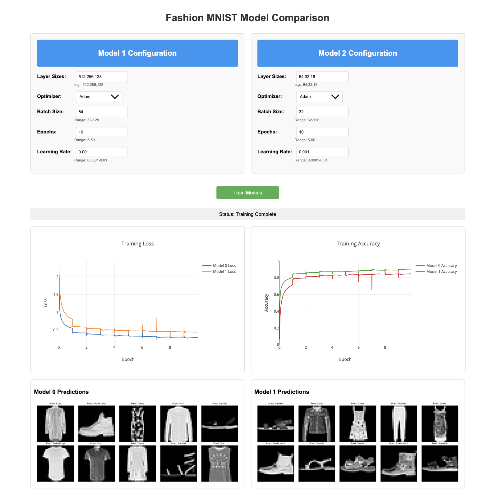

# Fashion MNIST Live Training Visualization

An interactive web-based visualization tool for training a neural network on the Fashion MNIST dataset with real-time monitoring capabilities.

## Web Interface


*Real-time training visualization showing loss curves, accuracy, and predictions*

## Key Features

### Neural Network Architecture
- 4-layer neural network (784 → 512 → 256 → 128 → 10)
- ReLU activation functions
- Dropout layers for regularization (0.2)
- Cross-entropy loss function
- Adam optimizer

### Real-time Visualization
- Live training progress monitoring
- Epoch-wise loss curve
- Epoch-wise accuracy curve
- Automatic chart updates
- Training status indicators

### Model Performance
- GPU acceleration with CUDA support
- Batch processing for efficient training
- Real-time accuracy metrics
- Post-training prediction visualization

### Interactive Web Interface
- Clean, responsive design
- Dynamic charts using Chart.js
- Grid visualization of model predictions
- Automatic updates without page refresh

### Technical Features
- Multi-threaded execution (training and web server)
- Thread-safe metric updates
- Automatic device selection (CPU/GPU)
- Progress persistence during browser refresh

## Requirements

1. Create a virtual environment (optional but recommended): 
```
fashion_mnist_live/
├── README.md
├── requirements.txt
├── train.py
├── model.py
├── templates/
│   └── index.html
└── static/
    └── js/
        └── chart.js
```

## Result
